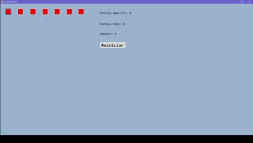
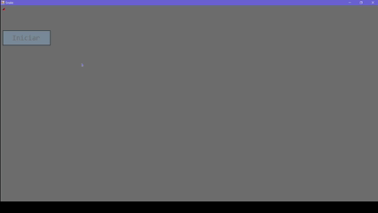

# GameDev-Portfolio
Mi portafolio personal de Game Development.

📋 Tabla de Contenidos

 - [C# Visual Studio](#juegos-en-c-visual-studio)
 - [Unity](#unity)
 - [Otros proyectos](#otros-proyectos)
 - [Tecnologías](#tecnologías)
 - [Contacto](#-contacto)

---

## Juegos en C# Visual Studio

### 🚢 Battleship
Un clásico juego de estrategia naval donde los jugadores colocan estratégicamente barcos en una cuadrícula y se turnan para intentar hundir la flota del oponente. Incluye jugabilidad por turnos, detección de impactos y lógica de condiciones de victoria.

Características Principales:

 - Sistema de tablero de juego basado en cuadrícula
 - Oponente con lógica de puntería
 - Sistema de retroalimentación de aciertos/fallos

🔗 [Código Fuente](https://github.com/FranciscoJHOrnelas/NoraProjects/blob/main/BattleShip.zip) | [Descargar Ejecutable](https://github.com/FranciscoJHOrnelas/NoraProjects/blob/main/BattleShip.exe)

### 🔴 Conecta 4
El juego atemporal de conexión para dos jugadores donde los jugadores dejan caer fichas de colores en una cuadrícula vertical, intentando conectar cuatro en línea horizontal, vertical o diagonalmente.

Características Principales:

 - Colocación de fichas basada en gravedad
 - Detección de condiciones de victoria (horizontal, vertical, diagonal)
 - Sistema de juego para dos jugadores con puntaje
 - Detección de empates 

🔗 [Código Fuente](https://github.com/FranciscoJHOrnelas/NoraProjects/blob/main/ConectaCuatroP.zip) | [Descargar Ejecutable](https://github.com/FranciscoJHOrnelas/NoraProjects/blob/main/Conecta%20Cuatro.exe)

### 🔢 Number Shuffle
Un juego de rompecabezas deslizante donde el jugador ordena fichas numeradas deslizándolas hacia un espacio vacío, poniendo a prueba el razonamiento espacial y las habilidades de resolución de problemas.

Características Principales:

 - Mecánicas de deslizamiento de fichas
 - Algoritmo de mezcla del rompecabezas
 - Contador de tiempo
 - Indicador de siguiente ficha sin ordenar

🔗 [Código Fuente](https://github.com/FranciscoJHOrnelas/NoraProjects/blob/main/NumberShuffleP.zip) | [Descargar Ejecutable](https://github.com/FranciscoJHOrnelas/NoraProjects/blob/main/Number%20Shuffle.exe)

### 🐍 Snake
El clásico juego arcade donde los jugadores controlan una serpiente en crecimiento, comiendo comida mientras evitan colisiones con las paredes y el propio cuerpo de la serpiente.

Características Principales:

 - Sistema de movimiento fluido de la serpiente
 - Detección de colisiones (paredes, auto-colisión, comida)
 - Crecimiento dinámico de la serpiente
 - Sistema de seguimiento de puntuación

🔗 [Código Fuente](https://github.com/FranciscoJHOrnelas/NoraProjects/blob/main/SnakeP.zip) | [Descargar Ejecutable](https://github.com/FranciscoJHOrnelas/NoraProjects/blob/main/Snake.exe)

### 🃏 Solitario
Una implementación del juego de cartas para un solo jugador con la variación clásica Klondike, donde los jugadores organizan cartas en pilas de fundación por palo y rango.

Características Principales:

 - Sistema de arrastre y colocación de cartas
 - Validación de reglas para movimientos legales

🔗 [Código Fuente](https://github.com/FranciscoJHOrnelas/NoraProjects/blob/main/SolitaireP.zip) | [Descargar Ejecutable](https://github.com/FranciscoJHOrnelas/NoraProjects/blob/main/Solitaire.exe)

### 💣 Buscaminas
Un juego de rompecabezas donde los jugadores revelan casillas en una cuadrícula mientras evitan minas ocultas, usando pistas numéricas para deducir las casillas seguras.

Características Principales:

 - Sistema de marcado para minas sospechosas
 - Diferentes posibles tamaños de tablero

🔗 [Código Fuente](https://github.com/FranciscoJHOrnelas/NoraProjects/blob/main/BuscaminasP.zip) | [Descargar Ejecutable](https://github.com/FranciscoJHOrnelas/NoraProjects/blob/main/Buscaminas.exe)

---

## Unity
### 📸 World of Pictures
Un juego en primera persona donde el objetivo es capturar fotos de diversos animales en su hábitat natural a través de diferentes interacciones con el ambiente o artículos secundarios.

Características Principales:

 - Detección de objetivos en fotos
 - Sistema de Waypoints
 - Galeria con capturas anteriores

Tecnologías: Unity, C#.

🔗 [Jugar en Itch.io ](https://noravictoria.itch.io/gamename)| 

---

## Otros proyectos

### 🍿 PopcornVision
Aplicación web sencilla que utiliza realidad aumentada para mostrar alimentos normalmente encontrados en cines tales como palomitas, sodas y nachos.

Características Principales:

 - Muestra los objetos como filtro sobre la cámara.
 - Menú para seleccionar diferentes artículos y tamaños.

🔗 [Código Fuente](https://github.com/DeysiRR/PopcornVision) | [Probar](https://deysirr.github.io/PopcornVision/)

---

## Tecnologías
### Lenguajes de Programación:

 - C#
 - C++
 - Java

### Motores y Frameworks de Juego:

 - Unity
 - Visual Studio (Windows Forms)

### Herramientas de creación de Assets:

 - Blender (Modelos 3D)
 - MagicaVoxel (VoxelArt)
 - Piskel (Pixelart)
 - Bosca Ceoil (Música)

---

## 📫 Contacto

 - GitHub: [Perfil de GitHub](https://github.com/FranciscoJHOrnelas)
 - Email: fhernandez80@uabc.edu.mx / nora.passato@gmail.com 
 - Itch.io: [Perfil de Itch.io](https://noravictoria.itch.io/)
 - LinkedIn: [LinkedIn](https://www.linkedin.com/in/francisco-javier-hernandez-ornelas-6382bb248/)
